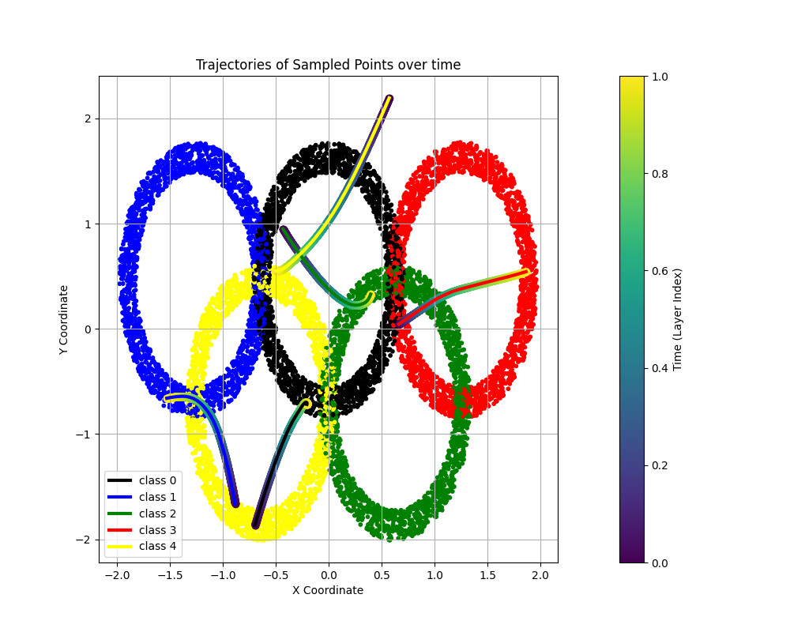

# Flow Models - Implementation and Analysis

This codebase implements and examines different types of flow models using PyTorch. It covers normalizing flows as well as flow matching models, including both unconditional and conditional variants. The repository provides a comprehensive exploration of these flow-based techniques.

## Table of Contents

- [Introduction](#introduction)
- [File Structure](#file-structure)
- [Normalizing Flows](#normalizing-flows)
- [Unconditional Flow Matching](#unconditional-flow-matching)
- [Conditional Flow Matching](#conditional-flow-matching)
- [Results and Analysis](#results-and-analysis)
- [Usage](#usage)
- [Dependencies](#dependencies)

## Introduction

Flow models are a class of generative models that learn to transform a simple distribution (e.g., a standard Gaussian) into a complex data distribution. They do this by learning a series of invertible transformations that can be composed to map between the two distributions. This repository explores two main types of flow models:

1.  **Normalizing Flows:** These models use a sequence of invertible transformations to map between a simple base distribution and a complex target distribution.
2.  **Flow Matching:** These models learn the dynamics of a continuous-time transformation process, allowing for the generation of samples at arbitrary time points.

## File Structure
-   **`model_builder.py`:** Implements all model architectures and loss functions (criterions) used in the project.
-   **`normalizing_flows_engine.py`:** This file houses the core training loop implementation for the normalizing flow model.
-   **`flow_matching_engine.py`:** This file houses the core training loop implementation for the flow matching model.
-   **`normalizing_flows_main.py`:** Provides code for training and evaluating the normalizing flow model.
-   **`flow_matching_main.py`:** Contains code for training and evaluating the flow matching model (both unconditional and conditional versions), generating samples, and visualizing trajectories.
-   **`create_data.py`:** Includes functions for generating the Olympic rings dataset used in the experiments.
-   **`utils.py`:** Contains utility functions for data loading, model saving/loading, and plotting.

## Normalizing Flows
Normalizing flows are implemented using a sequence of affine coupling layers and permutation layers.
The affine coupling layers introduce dependencies between the dimensions of the data, while the permutation layers shuffle the dimensions to ensure that all dimensions are transformed.
The model is trained using maximum likelihood estimation, and the loss function includes the log-determinant of the Jacobian to ensure invertibility of the transformations.

## Unconditional Flow Matching

The flow matching model learns a continuous-time transformation process that maps between a simple distribution and the target distribution. The model is trained using a loss function that encourages the model to match the true flow of the data. The model can generate samples at arbitrary time points by propagating the initial samples through the learned flow field.

## Conditional Flow Matching

The conditional flow matching model extends the unconditional model by incorporating conditional information, such as class labels. This allows the model to generate samples conditioned on specific classes, enabling more fine-grained control over the generated data.

## Results and Analysis

The results and analysis are detailed in the accompanying PDF report, which includes visualizations and discussions of the following:

-   **Normalizing Flows:**
    -   Loss and its components over epochs.
    -   Samples generated with different random seeds.
    -   Sampling over time, showing the progression of samples through the model layers.
    -   Trajectories of sampled points over time.
    -   Probability estimation and inverse trajectories.
-   **Unconditional Flow Matching:**
    -   Training loss over epochs.
    -   Flow progression of sampled points over time.
    -   Point trajectories and the effect of time quantization.
    -   Reversing the flow and comparing trajectories.
-   **Conditional Flow Matching:**
    -   Training data and flow trajectories for points from each class.
    -   Sampling with class conditioning.

## Usage

To train and evaluate the models, follow these steps:

1.  Clone the repository: `git clone <repository_url>`
2.  Install the dependencies: `pip install -r requirements.txt`
3.  Run the analysis scripts:
    -   `python normalizing_flows_main.py`
    -   `python flow_matching_main.py`
    
The scripts will train the models, generate samples, and save the results in the `plots` directory.

## Dependencies

-   PyTorch
-   NumPy
-   Matplotlib
-   tqdm